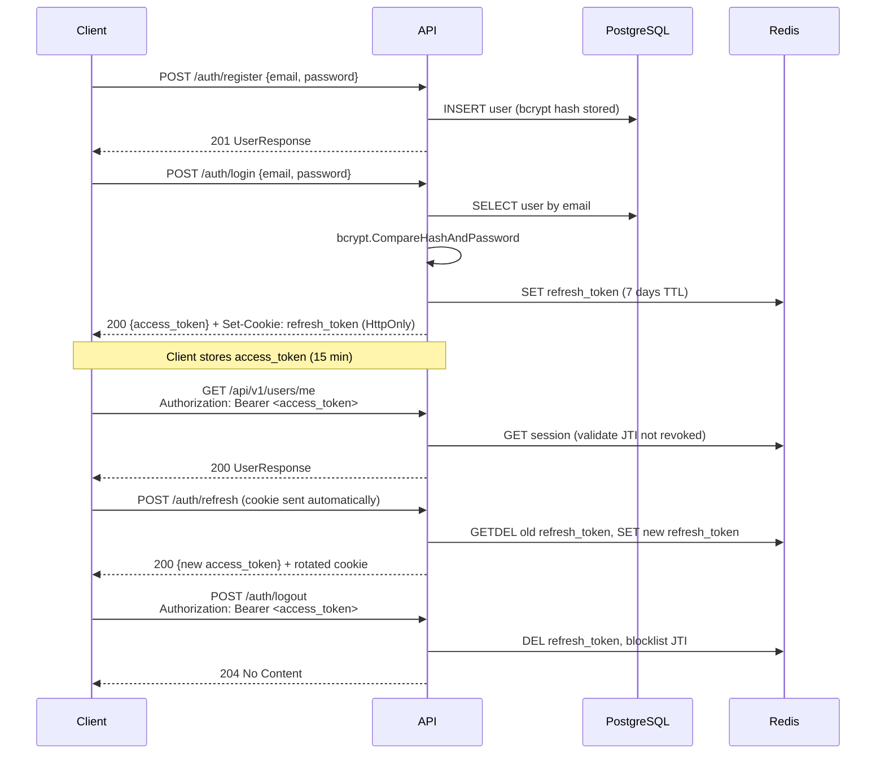

# Auth & Users — API Guide

This page covers every auth and user endpoint with complete `curl` examples, response shapes, error codes, and token management details.

!!! tip "Prefer a GUI?"
    Use [Swagger UI](http://localhost:8080/swagger/index.html) for interactive testing — the same requests, zero typing.

---

## Prerequisites

Make sure the stack is running:

```bash
curl http://localhost:8080/readyz
# → {"status":"ready","db":true,"redis":true}
```

All examples use `localhost:8080`. Replace with your deployed host if needed.

---

## Authentication flow



---

## Auth endpoints

### POST /api/v1/auth/register

Create a new user account. The password is stored as a bcrypt hash — never in plain text.

**Request**

```bash
curl -s -X POST http://localhost:8080/api/v1/auth/register \
  -H "Content-Type: application/json" \
  -d '{
    "email": "alice@example.com",
    "password": "SuperSecret123!"
  }' | jq .
```

**201 Created**

```json
{
  "id": "a1b2c3d4-e5f6-7890-abcd-ef1234567890",
  "email": "alice@example.com",
  "role": "user",
  "is_active": true,
  "created_at": "2026-04-14T10:00:00Z",
  "updated_at": "2026-04-14T10:00:00Z"
}
```

**Error responses**

| Status | Condition | Body |
|--------|-----------|------|
| `400` | Missing or invalid field | `{"error":"validation failed","details":"..."}` |
| `409` | Email already registered | `{"error":"email already in use"}` |

```bash
# Duplicate email
curl -s -X POST http://localhost:8080/api/v1/auth/register \
  -H "Content-Type: application/json" \
  -d '{"email":"alice@example.com","password":"Another1!"}' | jq .
# → {"error":"email already in use"}
```

---

### POST /api/v1/auth/login

Authenticate with email and password. Returns a short-lived **access token** in the body and a long-lived **refresh token** as an `HttpOnly` cookie.

**Request**

```bash
curl -s -X POST http://localhost:8080/api/v1/auth/login \
  -H "Content-Type: application/json" \
  -c cookies.txt \
  -d '{
    "email": "alice@example.com",
    "password": "SuperSecret123!"
  }' | jq .
```

!!! tip "`-c cookies.txt`"
    Saves the `refresh_token` cookie so subsequent calls to `/auth/refresh` and `/auth/logout` send it automatically. Use `-b cookies.txt` to read it back.

**200 OK**

```json
{
  "access_token": "eyJhbGciOiJSUzI1NiIsInR5cCI6IkpXVCJ9.eyJzdWIiOiJhMWIyYzNkNC0...",
  "expires_at": "2026-04-14T10:15:00Z"
}
```

The `Set-Cookie` header in the response:

```
Set-Cookie: refresh_token=<token>; Path=/; HttpOnly; Secure; SameSite=Strict; Max-Age=604800
```

**Token lifetimes**

| Token | Default TTL | Storage | Configurable via |
|-------|------------|---------|-----------------|
| Access token | 15 minutes | Response body (client memory) | `JWT_ACCESS_TOKEN_TTL_MINUTES` |
| Refresh token | 7 days | `HttpOnly` cookie + Redis | `JWT_REFRESH_TOKEN_TTL_DAYS` |

**Error responses**

| Status | Condition | Body |
|--------|-----------|------|
| `400` | Missing field | `{"error":"validation failed"}` |
| `401` | Wrong password or unknown email | `{"error":"invalid credentials"}` |

---

### POST /api/v1/auth/refresh

Exchange the refresh cookie for a new access token. The refresh token is **rotated** on every call — the old one is invalidated immediately.

**Request**

```bash
curl -s -X POST http://localhost:8080/api/v1/auth/refresh \
  -b cookies.txt \
  -c cookies.txt | jq .
```

**200 OK** — same shape as login:

```json
{
  "access_token": "eyJhbGciOiJSUzI1NiIsInR5cCI6IkpXVCJ9.eyJzdWIiOiJhMWIyYzNk...",
  "expires_at": "2026-04-14T10:30:00Z"
}
```

**Error responses**

| Status | Condition |
|--------|-----------|
| `401` | Cookie absent, expired, or already used (rotation) |

!!! warning "Token rotation"
    Each refresh call invalidates the previous refresh token. If two concurrent refresh requests race, the second will receive `401`. Implement retry logic with a short backoff in clients.

---

### POST /api/v1/auth/logout

Revoke the current session. The access token's JTI is blocklisted in Redis and the refresh token cookie is deleted.

**Request**

```bash
TOKEN="eyJhbGciOiJSUzI1NiIsInR5cCI6IkpXVCJ9..."

curl -s -X POST http://localhost:8080/api/v1/auth/logout \
  -H "Authorization: Bearer $TOKEN" \
  -b cookies.txt \
  -c cookies.txt
# → 204 No Content (empty body)
```

After logout, using the same `$TOKEN` returns `401`.

**Error responses**

| Status | Condition |
|--------|-----------|
| `401` | Token absent, expired, or already revoked |

---

## User endpoints

All user endpoints require a valid `Authorization: Bearer <token>` header.

### GET /api/v1/users/me

Returns the profile of the currently authenticated user.

**Request**

```bash
TOKEN="eyJhbGciOiJSUzI1NiIsInR5cCI6IkpXVCJ9..."

curl -s http://localhost:8080/api/v1/users/me \
  -H "Authorization: Bearer $TOKEN" | jq .
```

**200 OK**

```json
{
  "id": "a1b2c3d4-e5f6-7890-abcd-ef1234567890",
  "email": "alice@example.com",
  "role": "user",
  "is_active": true,
  "created_at": "2026-04-14T10:00:00Z",
  "updated_at": "2026-04-14T10:00:00Z"
}
```

---

### GET /api/v1/users — list users (admin only)

Returns a paginated list of all users.

**Request**

```bash
ADMIN_TOKEN="eyJhbGciOiJSUzI1NiIsInR5cCI6IkpXVCJ9..."

# Default page (page=1, per_page=20)
curl -s "http://localhost:8080/api/v1/users" \
  -H "Authorization: Bearer $ADMIN_TOKEN" | jq .

# Custom pagination
curl -s "http://localhost:8080/api/v1/users?page=2&per_page=5" \
  -H "Authorization: Bearer $ADMIN_TOKEN" | jq .
```

**Query parameters**

| Parameter | Type | Default | Max | Description |
|-----------|------|---------|-----|-------------|
| `page` | integer | `1` | — | Page number (1-indexed) |
| `per_page` | integer | `20` | `100` | Items per page |

**200 OK**

```json
{
  "users": [
    {
      "id": "a1b2c3d4-e5f6-7890-abcd-ef1234567890",
      "email": "alice@example.com",
      "role": "user",
      "is_active": true,
      "created_at": "2026-04-14T10:00:00Z",
      "updated_at": "2026-04-14T10:00:00Z"
    },
    {
      "id": "b2c3d4e5-f6a7-8901-bcde-f12345678901",
      "email": "bob@example.com",
      "role": "admin",
      "is_active": true,
      "created_at": "2026-04-14T09:00:00Z",
      "updated_at": "2026-04-14T09:00:00Z"
    }
  ],
  "total": 2,
  "page": 1,
  "per_page": 20
}
```

**Error responses**

| Status | Condition |
|--------|-----------|
| `401` | No or invalid token |
| `403` | Token valid but role is not `admin` |

---

### GET /api/v1/users/{id}

Fetch a single user by UUID.

- **Regular users** can only fetch their own profile (same UUID as their token's `sub` claim).
- **Admins** can fetch any user.

**Request**

```bash
USER_ID="a1b2c3d4-e5f6-7890-abcd-ef1234567890"
TOKEN="eyJhbGciOiJSUzI1NiIsInR5cCI6IkpXVCJ9..."

curl -s "http://localhost:8080/api/v1/users/$USER_ID" \
  -H "Authorization: Bearer $TOKEN" | jq .
```

**200 OK** — same `UserResponse` shape as `/users/me`.

**Error responses**

| Status | Condition |
|--------|-----------|
| `401` | No or invalid token |
| `403` | Regular user requesting another user's profile |
| `404` | User ID does not exist |

---

### PUT /api/v1/users/{id}

Partially update a user. All fields are optional — only send what you want to change.

**Field-level access control**

| Field | Regular user (own account) | Admin |
|-------|---------------------------|-------|
| `email` | Yes | Yes |
| `role` | No | Yes |
| `is_active` | No | Yes |

**Request — update your own email**

```bash
USER_ID="a1b2c3d4-e5f6-7890-abcd-ef1234567890"
TOKEN="eyJhbGciOiJSUzI1NiIsInR5cCI6IkpXVCJ9..."

curl -s -X PUT "http://localhost:8080/api/v1/users/$USER_ID" \
  -H "Authorization: Bearer $TOKEN" \
  -H "Content-Type: application/json" \
  -d '{"email": "alice-new@example.com"}' | jq .
```

**Request — admin promotes a user to admin role**

```bash
ADMIN_TOKEN="eyJhbGciOiJSUzI1NiIsInR5cCI6IkpXVCJ9..."

curl -s -X PUT "http://localhost:8080/api/v1/users/$USER_ID" \
  -H "Authorization: Bearer $ADMIN_TOKEN" \
  -H "Content-Type: application/json" \
  -d '{"role": "admin"}' | jq .
```

**Request — admin deactivates a user**

```bash
curl -s -X PUT "http://localhost:8080/api/v1/users/$USER_ID" \
  -H "Authorization: Bearer $ADMIN_TOKEN" \
  -H "Content-Type: application/json" \
  -d '{"is_active": false}' | jq .
```

**200 OK** — returns the updated `UserResponse`.

**Error responses**

| Status | Condition |
|--------|-----------|
| `400` | Invalid field value (e.g. malformed email) |
| `401` | No or invalid token |
| `403` | Regular user trying to update another user, or trying to change `role`/`is_active` |
| `404` | User ID does not exist |
| `409` | New email already taken by another account |

---

### DELETE /api/v1/users/{id} — admin only

Soft-deletes a user (sets `is_active = false`). The record is retained in the database.

**Request**

```bash
USER_ID="a1b2c3d4-e5f6-7890-abcd-ef1234567890"
ADMIN_TOKEN="eyJhbGciOiJSUzI1NiIsInR5cCI6IkpXVCJ9..."

curl -s -X DELETE "http://localhost:8080/api/v1/users/$USER_ID" \
  -H "Authorization: Bearer $ADMIN_TOKEN"
# → 204 No Content (empty body)
```

**Error responses**

| Status | Condition |
|--------|-----------|
| `401` | No or invalid token |
| `403` | Token valid but role is not `admin` |
| `404` | User ID does not exist |

---

## Complete end-to-end example

The script below registers two users, promotes one to admin, and demonstrates every endpoint using a single cookie jar:

```bash
#!/usr/bin/env bash
set -euo pipefail

BASE="http://localhost:8080/api/v1"
COOKIES="cookies.txt"

echo "=== 1. Register alice (regular user) ==="
ALICE=$(curl -s -X POST "$BASE/auth/register" \
  -H "Content-Type: application/json" \
  -d '{"email":"alice@example.com","password":"Secret123!"}')
echo "$ALICE" | jq .
ALICE_ID=$(echo "$ALICE" | jq -r .id)

echo ""
echo "=== 2. Register bob (will become admin) ==="
BOB=$(curl -s -X POST "$BASE/auth/register" \
  -H "Content-Type: application/json" \
  -d '{"email":"bob@example.com","password":"Secret123!"}')
echo "$BOB" | jq .
BOB_ID=$(echo "$BOB" | jq -r .id)

echo ""
echo "=== 3. Login as alice ==="
ALICE_TOKEN=$(curl -s -X POST "$BASE/auth/login" \
  -H "Content-Type: application/json" \
  -c "$COOKIES" \
  -d '{"email":"alice@example.com","password":"Secret123!"}' | jq -r .access_token)
echo "alice token: ${ALICE_TOKEN:0:40}..."

echo ""
echo "=== 4. alice fetches her own profile ==="
curl -s "$BASE/users/me" -H "Authorization: Bearer $ALICE_TOKEN" | jq .

echo ""
echo "=== 5. alice tries to list all users (expect 403) ==="
curl -s "$BASE/users" -H "Authorization: Bearer $ALICE_TOKEN" | jq .

echo ""
echo "=== 6. Login as bob and promote himself (via direct DB) ==="
# In a real app you'd have a seed admin — here we promote via alice's token
# (This would fail; just demonstrating the promote endpoint shape)
BOB_TOKEN=$(curl -s -X POST "$BASE/auth/login" \
  -H "Content-Type: application/json" \
  -d '{"email":"bob@example.com","password":"Secret123!"}' | jq -r .access_token)

echo ""
echo "=== 7. alice updates her email ==="
curl -s -X PUT "$BASE/users/$ALICE_ID" \
  -H "Authorization: Bearer $ALICE_TOKEN" \
  -H "Content-Type: application/json" \
  -d '{"email":"alice-updated@example.com"}' | jq .

echo ""
echo "=== 8. Refresh alice's token ==="
NEW_TOKEN=$(curl -s -X POST "$BASE/auth/refresh" \
  -b "$COOKIES" -c "$COOKIES" | jq -r .access_token)
echo "new token: ${NEW_TOKEN:0:40}..."

echo ""
echo "=== 9. Logout alice ==="
curl -s -X POST "$BASE/auth/logout" \
  -H "Authorization: Bearer $NEW_TOKEN" \
  -b "$COOKIES" -c "$COOKIES"
echo "(204 No Content — empty body is expected)"

echo ""
echo "=== 10. Verify old token is rejected ==="
curl -s "$BASE/users/me" -H "Authorization: Bearer $NEW_TOKEN" | jq .
# → {"error":"token has been revoked"}

rm -f "$COOKIES"
echo ""
echo "Done."
```

Save as `e2e.sh`, make it executable (`chmod +x e2e.sh`), and run it against the running stack.

---

## JWT token internals

The access token is a signed **RS256 JWT**. You can inspect its claims without a secret:

```bash
TOKEN="eyJhbGciOiJSUzI1NiIsInR5cCI6IkpXVCJ9..."

# Decode the payload (middle segment, base64url)
echo "$TOKEN" | cut -d. -f2 | base64 -d 2>/dev/null | jq .
```

Example decoded payload:

```json
{
  "sub": "a1b2c3d4-e5f6-7890-abcd-ef1234567890",
  "email": "alice@example.com",
  "role": "user",
  "jti": "7f3d2a1b-...",
  "iat": 1744624800,
  "exp": 1744625700
}
```

| Claim | Description |
|-------|-------------|
| `sub` | User UUID — matches the `id` in `UserResponse` |
| `email` | User email at time of login |
| `role` | `user` or `admin` |
| `jti` | Unique token ID — used to blocklist on logout |
| `iat` | Issued-at (Unix timestamp) |
| `exp` | Expiry (Unix timestamp) — `iat + JWT_ACCESS_TOKEN_TTL_MINUTES × 60` |

---

## Rate limiting

Protected endpoints accept **100 requests per minute per authenticated user**. Exceeding this returns:

```
HTTP/1.1 429 Too Many Requests
Retry-After: 60
```

```json
{"error": "rate limit exceeded"}
```

---

## Common errors reference

| Status | Code string | Meaning |
|--------|-------------|---------|
| `400` | `validation failed` | Request body is malformed or a required field is missing |
| `401` | `missing authorization header` | No `Authorization: Bearer` header on a protected route |
| `401` | `invalid token` | Token signature invalid, malformed, or wrong algorithm |
| `401` | `token expired` | Access token past its `exp` claim — use `/auth/refresh` |
| `401` | `token has been revoked` | JTI was blocklisted (logout occurred) |
| `401` | `invalid credentials` | Email/password mismatch on login |
| `403` | `forbidden` | Valid token but insufficient role for this action |
| `404` | `not found` | The requested resource UUID does not exist |
| `409` | `email already in use` | Duplicate email on register or update |
| `429` | `rate limit exceeded` | 100 req/min cap reached for this user |
| `500` | `internal server error` | Unexpected server-side failure — check logs and Jaeger |

---

## Seeding an admin user

The first user registered through the API always receives the `user` role. To create an admin for a fresh environment, connect directly to Postgres:

```bash
docker exec -it kleido-postgres-1 psql -U user -d kleido -c \
  "UPDATE users SET role = 'admin' WHERE email = 'alice@example.com';"
```

Then log in again to get a token with `role: admin`.
