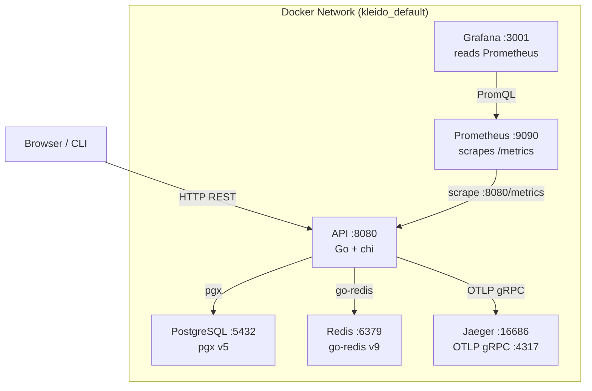

# Kleido — Developer Documentation

Kleido is a production-grade Go REST API with a full observability stack built in. This documentation covers everything you need to explore, monitor, and understand the running system.

## Service Map

Once the stack is up (`docker-compose up --build -d` from the repo root), every service is available on localhost:

| Service | URL | Credentials | Purpose |
|---------|-----|-------------|---------|
| **API** | [localhost:8080](http://localhost:8080) | — | REST API |
| **Swagger UI** | [localhost:8080/swagger/index.html](http://localhost:8080/swagger/index.html) | — | Interactive API explorer |
| **Docs** | [localhost:8001](http://localhost:8001) | — | This documentation site |
| **Jaeger UI** | [localhost:16686](http://localhost:16686) | — | Distributed trace viewer |
| **Prometheus** | [localhost:9090](http://localhost:9090) | — | Metrics query engine |
| **Grafana** | [localhost:3001](http://localhost:3001) | `admin` / `admin` | Pre-built dashboards |
| **Raw metrics** | [localhost:8080/metrics](http://localhost:8080/metrics) | — | Prometheus scrape target |

## Architecture



## Request Lifecycle

Every inbound HTTP request passes through the following middleware chain before reaching a handler:

```
Request
  │
  ├─ Tracing          → creates root OpenTelemetry span (injected into context)
  ├─ RequestID        → assigns X-Request-ID header
  ├─ RealIP           → resolves client IP from X-Forwarded-For
  ├─ PanicRecovery    → catches panics, increments kleido_http_panics_total
  ├─ SecurityHeaders  → sets CSP, X-Frame-Options, etc.
  ├─ HTTPMetrics      → records kleido_http_requests_total / _duration_seconds
  ├─ RequestLogger    → emits structured JSON log line (with trace_id)
  ├─ CORS             → handles preflight, injects Access-Control headers
  │
  ├─ [protected routes only]
  │   ├─ JWT          → validates RS256 Bearer token, loads claims into context
  │   └─ RateLimit    → 100 req/min per user (Redis token bucket)
  │
  └─ Handler → Service → Repository → PostgreSQL / Redis
```

## Documentation Sections

<div class="grid cards" markdown>

-   **Getting Started**

    ---

    Start the stack, generate keys, verify every service is healthy.

    [→ Getting Started](getting-started.md)

-   **Swagger UI**

    ---

    Explore and call every API endpoint interactively without writing a single line of code.

    [→ Swagger UI](swagger.md)

-   **Jaeger**

    ---

    Follow a request from HTTP handler down to the database query using distributed traces.

    [→ Jaeger](jaeger.md)

-   **Prometheus**

    ---

    Query raw metrics — request rates, latencies, error rates, cache performance.

    [→ Prometheus](prometheus.md)

-   **Grafana**

    ---

    Pre-built dashboard with colour-coded thresholds covering every key signal.

    [→ Grafana](grafana.md)

</div>
