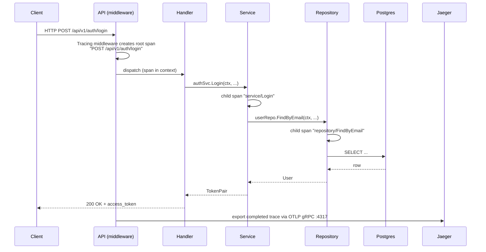

# Jaeger — Distributed Tracing

Jaeger is available at:

**[http://localhost:16686](http://localhost:16686)**

It records every request's journey through the system as a **trace** — a tree of timed **spans** that shows exactly which functions ran, in what order, and how long each took.

---

## How tracing works in Kleido



The **trace ID** is also injected into every structured log line as `trace_id`, making it possible to jump directly from a log entry to its trace.

---

## Spans emitted

### HTTP layer

| Span name | Created by | Key attributes |
|-----------|-----------|----------------|
| `{METHOD} {route}` | `middleware.Tracing()` | `http.method`, `http.route`, `http.status_code` |

Examples: `GET /api/v1/users/{id}`, `POST /api/v1/auth/login`

### Service layer

| Span name | Operation |
|-----------|-----------|
| `service/Register` | New user registration (bcrypt hash + DB insert) |
| `service/Login` | Credential verification + token issuance |
| `service/GetByID` | User fetch — checks Redis cache first, then Postgres |
| `service/GetByEmail` | User lookup by email (no cache) |

### Repository layer

| Span name | DB operation | Attributes |
|-----------|-------------|------------|
| `repository/Create` | `INSERT` | `db.system=postgresql`, `db.operation=INSERT`, `user.id` |
| `repository/FindByID` | `SELECT` | `db.operation=SELECT`, `user.id` |
| `repository/FindByEmail` | `SELECT` | `db.operation=SELECT` *(email omitted — PII)* |
| `repository/Update` | `UPDATE` | `db.operation=UPDATE`, `user.id` |
| `repository/Delete` | `UPDATE is_active=false` | `db.operation=UPDATE`, `user.id` |
| `repository/List` | `SELECT` (paginated) | `db.operation=SELECT` |

### Sampling policy

| Environment | Policy | Effect |
|-------------|--------|--------|
| `development` | `AlwaysSample` | Every request is recorded |
| `production` / `staging` | `TraceIDRatioBased(0.1)` | ~10% of requests recorded |

---

## Finding a trace

### Method 1 — Search by service

1. Open [http://localhost:16686](http://localhost:16686)
2. In the **Service** dropdown select **kleido**
3. Optionally filter by **Operation** (e.g. `POST /api/v1/auth/login`)
4. Set a time range and click **Find Traces**
5. Click any result row to open the trace timeline

### Method 2 — Jump from a log line

Every API log line contains `trace_id` when a trace is active:

```bash
docker logs kleido-api-1 2>&1 | grep trace_id | tail -5
```

Example log line:

```json
{
  "time": "2026-04-14T10:05:00Z",
  "level": "INFO",
  "msg": "request completed",
  "method": "POST",
  "path": "/api/v1/auth/login",
  "status": 200,
  "duration_ms": 42,
  "trace_id": "4bf92f3577b34da6a3ce929d0e0e4736",
  "span_id":  "00f067aa0ba902b7"
}
```

To jump to that trace:

1. Copy the `trace_id` value
2. In Jaeger UI click the search icon → paste into **Trace ID** field → press Enter

### Method 3 — Direct URL

```
http://localhost:16686/trace/<trace_id>
```

---

## Reading a trace timeline

Once you open a trace you will see a waterfall like this:

```
kleido: POST /api/v1/auth/login                        42ms ████████████████████
  └─ service/Login                                     38ms ██████████████████
       └─ repository/FindByEmail                        5ms ██
       └─ repository/Create  [session in Redis]         1ms █
```

**How to read it:**

- **Width** = time taken (wider = slower)
- **Indentation** = call depth (children ran inside their parent)
- Click any span row to expand its **tags** and **logs**
- Red spans indicate an error was recorded on that span

---

## Diagnosing a slow request

1. Find a trace with a long root span
2. Look at which child spans are widest — that's your bottleneck
3. Expand the `repository/*` span: the `db.statement` tag shows the exact SQL query
4. Cross-reference with Prometheus (`kleido_db_query_duration_seconds`) for aggregate data

---

## Disabling tracing

Set `OTEL_ENABLED=false` in `.env` (or as an environment variable in `docker-compose.yml`) and restart the API. All span instrumentation becomes a no-op and no connections are made to the OTLP endpoint.

---

## Configuration reference

| Variable | Default | Description |
|----------|---------|-------------|
| `OTEL_ENABLED` | `true` | Enable/disable tracing |
| `OTEL_EXPORTER_OTLP_ENDPOINT` | `localhost:4317` | OTLP gRPC endpoint. Use `jaeger:4317` inside docker-compose |
| `SERVICE_NAME` | `kleido` | Appears as the service name in Jaeger |

---

## Jaeger ports

| Port | Protocol | Purpose |
|------|----------|---------|
| **16686** | HTTP | Jaeger UI |
| **4317** | gRPC | OTLP trace ingestion (API → Jaeger) |
| **4318** | HTTP | OTLP HTTP ingestion (alternative) |
